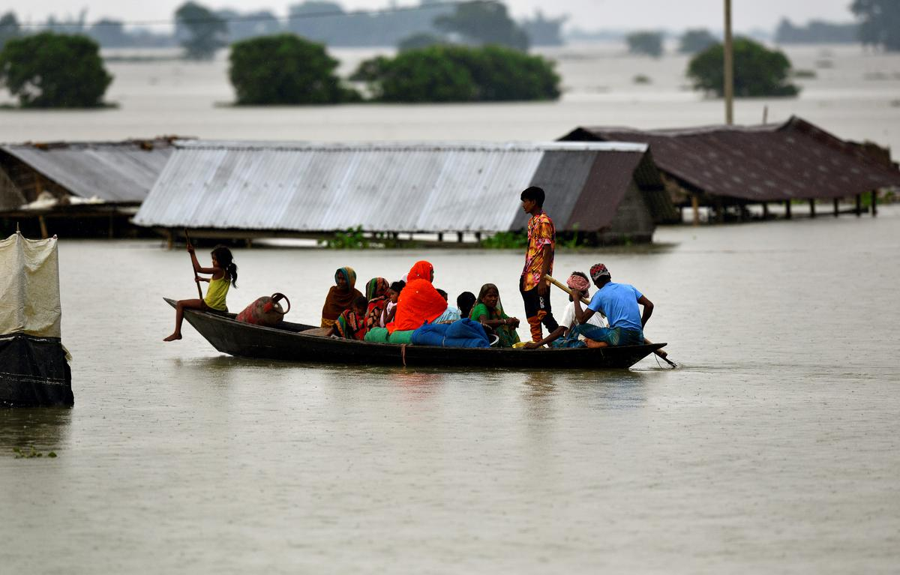

# Assam Flood Response

<a href="https://www.thehindu.com/news/national/other-states/assam-flood-situation-critical-ndrf-personnel-from-bhubaneswar-rushed-to-barak-valley/article65548969.ece"> Image source - The Hindu </a>

Assam urgently needs our attention & support to combat the floods. We have curated a list of links to understand the on-ground situation better & to contribute funds to ongoing relief efforts. Please read and contribute in any way possible.

## Links to News reports:

1. [Flood reporting and information management system](http://sdmassam.nic.in/reports.html) - Assam State Disaster Management Authority
2. [Assam: Death and despair after deadliest urban flood in India](https://www.bbc.com/news/av/world-asia-india-61996296) - BBC News
3. [Assam flood: Death Toll Rises To 179, Number Of Affected People Declines To 18.35 Lakh](https://www.outlookindia.com/national/assam-flood-death-toll-rises-to-179-number-of-affected-people-declines-to-1835-lakh-news-206567) - Outlook
4. [Unprecedented flood cripples Assam, massive loss of life and property reported](https://india.mongabay.com/2022/06/unprecedented-flood-cripples-assam-massive-loss-of-life-and-property-reported/) - Mongabay
5. [Explained: Why does Assam flood every year and what’s the state doing about it?](https://www.newslaundry.com/2022/06/27/explained-why-does-assam-flood-every-year-and-whats-the-state-doing-about-it) - Newslaundy

## Links for Contributions:
### Government:
1. [CM Relief Fund](https://cm.assam.gov.in/donate): Chief Minister's Relief Fund. **Eligible for Tax Benefits**
### Non-Government:
#### Eligible for International donations:
1. [UNICEF](https://help.unicef.org/in/assam-floods-2022-homepage): Their campaign is focused on providing relief and aid to children in flood affected areas of Assam.  **Eligible for Tax Benefits**
2. [Goonj](https://goonj.org/assam-floods/): National NGO that is working through collection camps in various flood affected districts of Assam.  **Eligible for Tax Benefits** 
3. [SEEDS India](https://www.seedsindia.org/assamfloodsresponse2022/): Delhi-based NGO that provides relief works in environmental disasters.  **Eligible for Tax Benefits**
4. [SeSTA India](https://milaap.org/fundraisers/support-flood-affected-communities): SeSTA works through Self Help Groups in parts of Lower Assam which is the most impacted area by floods this year.  **Eligible for Tax Benefits**
5. [Association of Social and Humane Activist](https://www.donatekart.com/ASHA/Help-Assam-Flood-Victims?gclid=EAIaIQobChMIu8bCjYnf-AIVBPuPCh1VsAj4EAEYASAAEgJ8B_D_BwE): Assam based non-profit NGO working towards upliftment of the poor needy people for their Education, Food, Shelter, Cloth, Health and other emergency requirements.  **Eligible for Tax Benefits**
6. [ActionAid Association (India)](https://www.actionaidindia.org/floods-in-the-north-east/): They are currently facilitate evacuation, dry ration, food, clean drinking water, and temporary relief such as shelter, food and hygiene kits for the families who have been affected in certain parts of the state of Assam. **Eligible for Tax Benefits**
7. [Save The Children](https://www.savethechildren.in/flood-in-assam-india-2022/): Humanitarian organisation responding to the crisis in Assam by reaching out to children in danger. They aim to reach 10,000 hoseholds and 22,000 children in 4 districts of Assam. **Eligible for Tax Benefits**

#### Eligible for Domestic donations:
1. [Hemkunt Foundation](https://hemkuntfoundation.com/donate-now/): National Level NGO that provides relief aid during disasters in over 20 states of India. In Assam their efforts are based in Silchar.  **Eligible for Tax Benefits**
2. [Humanitarian Aid International](https://hai-india.org/assam-flood-response-2022/): Focused on providing relief to displaced population and preparing situation report.  **Eligible for Tax Benefits**
3. [Robin Hood Army](https://robinhoodarmy.com): Freshly cooked food in flood affected areas where clean water for cooking is not available. They take donations only in kind not in cash.  **NOT Eligible for Tax Benefits**

We at [CivicDataLab](https://civicdatalab.in/) have been working with the state of Assam since 2017 to improve timely access to government data. As of last year, we have been focusing our efforts to build a [holistic data ecosystem](https://www.mcgovern.org/foundation-awards-4-5m-including-new-accelerator-grants-to-advance-data-driven-climate-solutions/) to help better respond to floods and build a long term resilience in partnership with [Open Contracting Partnership](https://www.open-contracting.org/) and [Patrick J. McGovern Foundation](https://www.mcgovern.org/) with the guidance from [Assam State Disaster Management Authority](http://sdmassam.nic.in/) & [Finance Department](https://finance.assam.gov.in/).

<footer>

 This work is licensed under a <a rel="license" href="http://creativecommons.org/licenses/by-sa/4.0/">Creative Commons Attribution-ShareAlike 4.0 International License</a>

Contact us at:<a href= "assam-floods@civicdatalab.in"> assam-floods@civicdatalab.in</a>
  

</footer>
